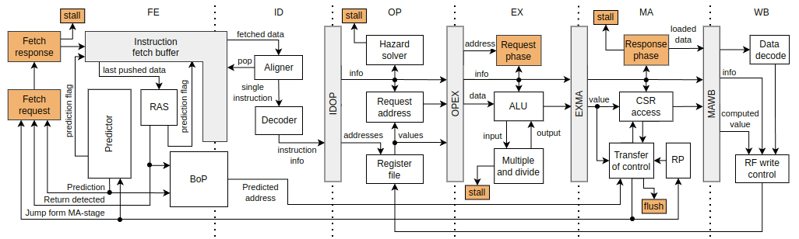

# Hardisc - hardened RISC-V IP core
The Hardisc is a 32-bit **RISC-V** IP core for application in harsh environments, where phenomenons like random bit-flips caused by the **Single-Event-Effects** (SEE) are a concern. 
It contains an in-order 6-stage pipeline with AMBA 3 AHB-Lite instruction/data bus interfaces.
Apart from the base 32-bit integer instruction set (I), the Hardisc also implements standard extensions of compressed instructions (C) and multiply and divide (M) instructions. 
Check the specification [here](https://github.com/riscv/riscv-isa-manual/releases/download/Ratified-IMAFDQC/riscv-spec-20191213.pdf).
An actual designator of the implemented instruction set is **RV32IMC**. 
The standard RISC-V [privilege modes](https://github.com/riscv/riscv-isa-manual/releases/download/Priv-v1.12/riscv-privileged-20211203.pdf) and settings are controlled via instructions from the **Zicsr** extension. 
Only the Machine mode is supported currently. The Hardisc is desribed in SystemVerilog.



Most of the processors used in SEE-intense environments are protected by replicating the whole cores, leverage lockstep technique, or require specialized fabrication technologies. 
These approaches limit the system frequency or require multiplies of system area or power consumption compared to an unprotected system with the same functionality. 
The Hardisc **integrates protection in the architecture of the pipeline**, providing faster fault detection and recovery. 
The **protection is based on replicating pipeline stages**, excluding protecting or replicating the large but not functionality-critical units (e.g., branch predictor).
It is **separable** from the rest of the pipeline, so it is possible to enable/disable the protection before simulation/synthesis. 
Check the configuration section below.

**For a detailed explanation of the pipeline, information on random bit flips due to SEE, and a survey of currently available protection approaches, check our research paper below. Please consider citing the document in your publications.**

* [In-Pipeline Processor Protection against Soft Errors](https://www.mdpi.com/2287290)

## Fault insertion

The RTL description supports fault the insertion into all flip-flops of the core to simulate bit-flips. 
Some wires were also selected to be prone to SEE, including all clocks and reset trees. 
The faults are inserted randomly in each bit of flip-flop or at the wire; the probability is configurable by options. A fault insertion condition is evaluated for each bit every clock cycle. 
Specific groups of flip-flops and wires are grouped so we can choose groups where fault insertion is enabled.

## Configuration and options
The Hardisc is configurable through options present in *settings.sv* file. 
These are pre-compile-time options. 
Some of the simulation parameters are command-line arguments and can be set post-compilation.

### Pre-Compile time
The Hardisc design is configurable through options present in *settings.sv* file. 

Some options enable functionalities when they are defined:
* **SIMULATION** - enables functionalities present only in the simulation (not-synthesizable)
* **PROTECTED** - enables pipeline protection
* **SEE_TESTING** - enables SEE insertion logic

Other available options:
| Option            | Default  | Description |
| :---------------- | :------: | :---------: |
| FIFO_SIZE         |    4     | Number of entries in Instruction Fetch Buffer  |
| BHT_SIZE          |   64     | Number of entries in Predictor's BHB     |
| BTB_SIZE          |   16     | Number of entries in Predictor's BTB       |
| JTB_SIZE          |    8     | Number of entries in Predictor's JTB       |
| SHARED            |   20     | Number of address bits not saved in Predictor's xTBs       |
| BOP_SIZE          |    3     | Number of entries in Buffer of Predictions |
| RAS_SIZE          |    2     | Number of entries in Return Address Stack  |

### Post-compile time

The simulation options configurable from the command line:

* **BOOTADD** - booting address in hexadecimal numbering system
* **CLKPERIOD** - duration of system clock period in picoseconds
* **TIMEOUT** - simulation time in number of clock-cycles
* **LOGGING** - controls logging verbosity (0-3)
* **LFILE** - file for dumping spike-like trace
* **LAT** - disables (0) or enables (other than 0) memory latencies
* **BIN** - binary to execute
* **SEE_PROB** - probability of SEE insertion
* **SEE_GROUP** - individual bits enables fault insertion in different groups, bit 0 enables each group

## Usage
This repository comes with Makefile, containing commands to set up, compile, and simulate a project in the free edition of ModelSim.
It contains an example testbench, memory, and interconnect IPs for simulation.
The folder */example* contains programs and their binaries that the Hardisc can directly execute in simulation.
If you want to change the source tests, you need the [RISC-V toolchain](https://github.com/riscv-collab/riscv-gnu-toolchain). 
When the toolchain is prepared, you can use the *compileTest* command in the Makefile to compile the selected tests.

Set up and compile the Hardisc project:
```bash
make hardiscSetup
make hardiscCompile
```
Simulate the *hello_world* example with memory latencies:
```bash
make hardiscSim BINARY=example/hello_world/test.bin LAT=1
```
Simulate the *matrix* example with SEE insertion in all groups and logging verbosity 2:
```bash
make hardiscSim BINARY=example/matrix/test.bin LOGGING=2 SEE_PROB=10
```
Compile the *matrix* example test:
```bash
make compileTest TEST_DIR=example/matrix
```

## Tracing and logging
The testbench, peripherals, and other model gives user several tracing and logging options.

If the *LOGGING==0*, only characters stored in the *CONTROL* memory location are printed to the console.
This memory location is used by syscalls from *printf* function.
The following figure shows an example output from the *hello_world* example:
```
Hello world!
Clock cycles since boot: 2256
Clock cycles since boot: 7906
Clock cycles since boot: 13890
Clock cycles since boot: 20670
Clock cycles since boot: 27589
```
If the *LOGGING>0*, the *tracer* module will print information from each pipeline stage.
```
[   242,    112, 0.463] FA: 1000034c | FD: 10000348 | ID: (41) sub     s2, s2, a5             | OP: 41 | EX: 41 | MA: 41 | WB: 41 ~ 10000334, V 10016000 -> R 8
[   243,    113, 0.465] FA: 10000350 | FD: 1000034c | ID: (41) srai    s2, s2, 1026           | OP: 41 | EX: 41 | MA: 41 | WB: 41 ~ 10000338, V 10016000 -> R18
[   244,    114, 0.467] FA: 10000354 | FD: 10000350 | ID: (02) beq     s2, zero, pc + 32      | OP: 41 | EX: 41 | MA: 41 | WB: 41 ~ 1000033c, V 100159fc -> R15
[   245,    115, 0.469] FA: 10000358 | FD: 10000354 | ID: (41) addi    s0, s0, -1540          | OP: 02 | EX: 41 | MA: 41 | WB: 41 ~ 10000340, V 10015a00 -> R18
[   246,    116, 0.472] FA: 1000035c | FD: 10000358 | ID: (41) li      s1, 0                  | OP: 41 | EX: 02 | MA: 41 | WB: 41 ~ 10000344, V 00000004 -> R18
[   247,    117, 0.474] FA: 10000360 | FD: 1000035c | ID: (44) lw      a5, 0(s0)              | OP: 41 | EX: 41 | MA: 02 | WB: 41 ~ 10000348, V 00000001 -> R18
```
If the *LOGGING>2* and fault insertion is active, you get information about where the fault is inserted.

```
[  1400,    687, 0.491] FA: 1000e030 | FD: 1000e02c | ID: (04) sw      ra, 1(sp)              | OP: 41 | EX: 41 | MA: 04 | WB: 04 ~ 1000e018, V
[  1401,    688, 0.491] FA: 1000e030 | FD: 1000e02c | ID: (04) no operation                   | OP: 04 | EX: 41 | MA: 41 | WB: 04 ~ 1000e01c, V
SEU in RF[11][ 2]
[  1402,    689, 0.491] FA: 1000e034 | FD: 1000e030 | ID: (04) sw      zero, 448(gp)          | OP: 00 | EX: 04 | MA: 41 | WB: 41 ~ 1000e020, V 10015a00 -> R 8
[  1403,    690, 0.492] FA: 1000e038 | FD: 1000e034 | ID: (42) jal     pc - 0xdebe            | OP: 04 | EX: 00 | MA: 04 | WB: 41 ~ 1000e024, V 00000001 -> R10
[  1404,    691, 0.492] FA: 1000e038 | FD: 1000e034 | ID: (42) no operation                   | OP: 42 | EX: 04 | MA: 00 | WB: 04 ~ 1000e028, V
SEU in CSR_MSCRATCH[ 1][ 0]
[  1405,    691, 0.492] FA: 1000e03c | FD: 1000e038 | ID: (41) li      a5, -1                 | OP: 00 | EX: 42 | MA: 04 | WB: 00 ~ 00000000,  
```

## Notes and limitations
* The architecture of the unprotected pipeline has been developed to integrate protection in the future, so some design approaches were selected with this bias.
* The RTL code style is purposefully selected to allow fault insertion (e.g., flip-flops in the *seu_regs* module).
* No special power optimizations are present.
* The protection of bus interfaces is yet to be integrated.
* The Hardisc is still in development.

## Issues and bugs
If you find any bug or a hole in the protection (also considered a bug), please create a new Issue report.

## Contributing
We highly appreciate your intention to improve the Hardisc.
If you want to contribute, create your own branch to commit your changes and then open a Pull Request.
If you have questions about the architecture or want to discuss improvements, please create a new thread in the Discussion tab.

## License
Unless otherwise noted, everything in this repository is covered by the Apache License, Version 2.0 (see LICENSE for full text).


